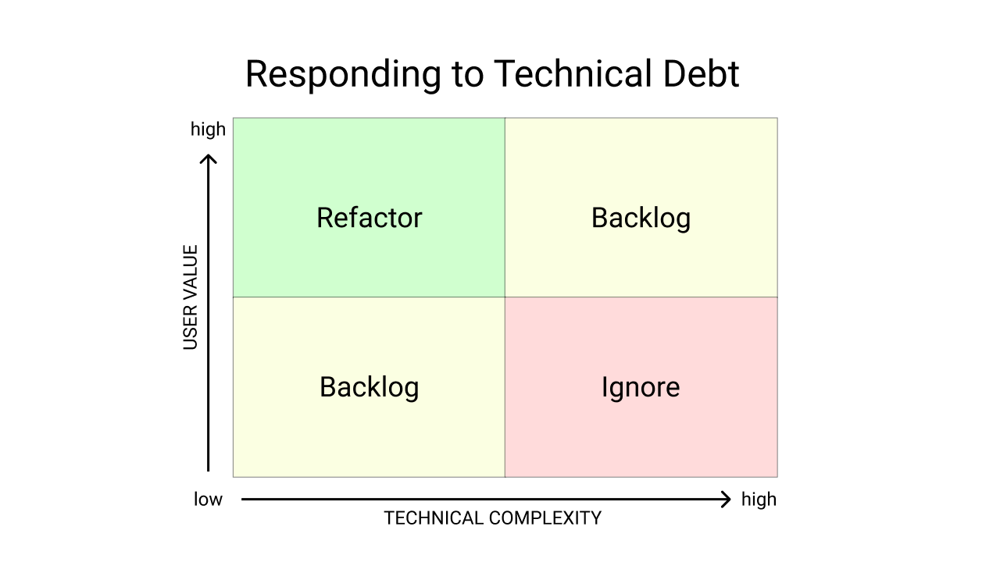

# Summary
A few thoughts on this kata: [stripComments](https://www.codewars.com/kata/51c8e37cee245da6b40000bd/train/javascript)

## Takeaways
This kata is a great example of unclear requirements and incomplete existing tests:
* looks like a single test in the provided test suite, so no confidence
* existing solutions provide little insight as they only seem to work on the single test case and not the requirements
* as a developer, would have to determine the value and complexity of addressing this technical debt and whether to invest any more time in it.

On the job, I would reach out for requirements clarity, rather than attempt to piece it together from code which I have little confidence in as I could be wasting time misintepreting the requirements.

## Requirements
* provided written requirements quality was low
* trimming of whitespace requirement only visible in provided example tests, not in the written description

## Tests
* seemed like only one or two tests in the provided test suite
* my passing code failed the corresponding test in my own test suite
* not going to reconcile difference in tests and going with the successful code as I understand the logic and provided requirements are vague (AKA want to move on - as per Technical Debt below!)

## Technical Debt



This kata, with seemingly a single provided test, is an example of technical debt, as existing tests pass a Happy Path (Happy Pass?) but do not fulfill the requirements.

### Considerations
* REFACTOR: if you can refactor within your time constraints, do so!
* BACKLOG: communicate with team and add to backlog for triage, grooming and prioritization
* IGNORE: communicate with team and come to consensus on ignoring


## Solution
* wasn't sure if the best solution was to parse an array or a string, either via string or regex. Instinct was to start with regex, as it is the most terse approach, but am not fluent enough
* once solved, site provided examples of other, more terse solutions - will review and refactor my own (see below)

## To Do
[in progress] using map, regex and replace.
- using reduce, map regex of marker array, ternery on current marker with true trimming from marker on accumulator

## Other Solutions
Here are some other, terser solutions to review and incorporate in a refactor:

```javascript
const solution = (input, markers) => input.replace( new RegExp(" [" + markers.join(',') + "].+", "gi"), '' );

function solution(input, markers) {
  return input.replace(/(\s\W\w+).*|(\s\W\s?\w+\s?\w+)/g, "");
};
```

Both of the above failed my tests

